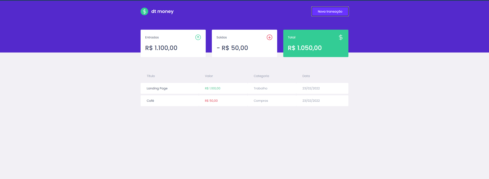

# DT Money

Um projeto de gerenciamento desenvolvido nas aulas da RocketSeat



## 🚀 Começando

Essas instruções permitirão que você obtenha uma cópia do projeto em operação na sua máquina local para fins de desenvolvimento e teste.

Consulte **Implantação** para saber como implantar o projeto.

### 📋 Pré-requisitos

De que coisas você precisa para instalar o software e como instalá-lo?

```
npm install yarn -g
```

```
yarn
```

## 📦 Desenvolvimento

```
yarn dev
```
## 🛠️ Construído com

* React
* TypeScript
* Mirage.js
* Axios
* Styled-components
* Polished


## ✒️ Autores


* **JVitorFC** - [Desenvolvedor](https://github.com/jvitorfc)


## 📄 Licença


